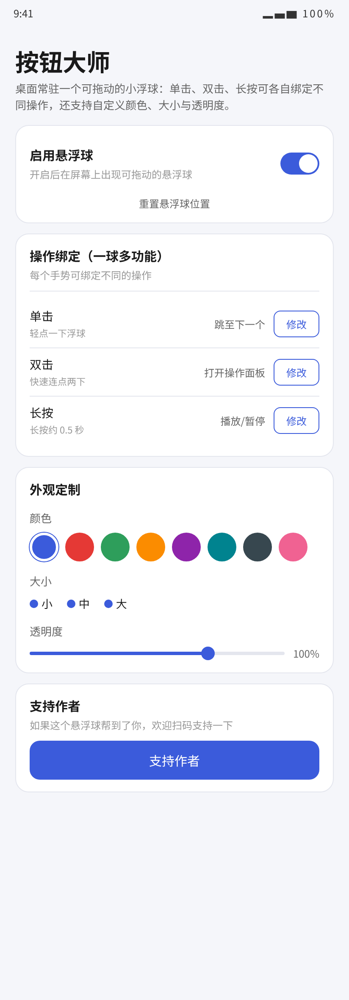
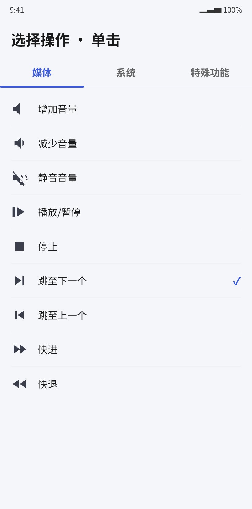
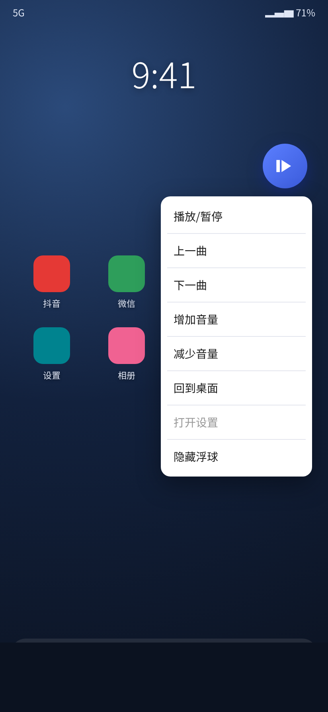

# 按钮大师悬浮球（ButtonBall）

一个类似「按钮大师」的 Android 应用：在桌面生成一个可拖动的小浮球，通过单击、双击、长按等手势执行你预先设置的操作，并支持自定义外观。

> **广告跳过小技巧**：可通过设置点击跳至下一个来实现强制跳过抖音/红果连续剧集的15s广告。

## 特性

- **一球多功能**：单击、双击、长按三个手势**各自独立绑定**一个动作。
- **快捷操作面板**：把某个手势绑定为「打开操作面板」，点一下即可快速执行
  播放/暂停、上一曲、下一曲、增减音量、回桌面、打开设置、隐藏浮球。
- **自定义外观**：颜色（8 色可选）、大小（小/中/大）、透明度（滑块）实时生效。
- **拖动 & 记忆位置**：浮球可拖动并吸附屏幕边缘，重启后记住上次位置。
- **媒体控制可靠**：播放/暂停/上下曲/快进快退支持「无权限」媒体键通道
  （`AudioManager.dispatchMediaKeyEvent`），无需任何授权即可控制当前媒体；
  授予通知使用权后还会用 MediaController 精确控制。
- **广告跳过**：通过设置点击「跳至下一个」可强制跳过抖音/红果等连续剧集的 15s 广告。

## 截图

| 主界面 | 操作选择 | 桌面悬浮球 |
|--------|----------|------------|
|  |  |  |

## 下载

- 最新安装包：**[buttonball-v0.0.1.apk](apk/buttonball-v0.0.1.apk)**（可直接安装，最低 Android 8.0）
- 源码：本仓库即可。

## 默认手势绑定（可在应用内修改）

| 手势 | 默认动作 |
|------|----------|
| 单击 | 跳至下一个 |
| 双击 | 打开操作面板 |
| 长按 | 播放/暂停 |

## 支持的动作

| 分类 | 动作 |
|------|------|
| 媒体 | 增加音量、减少音量、静音音量、播放/暂停、停止、跳至下一个、跳至上一个、快进、快退 |
| 系统（需无障碍） | 回到桌面、返回、最近任务、打开通知栏、快捷设置 |
| 特殊功能 | 打开操作面板、隐藏浮球、无操作 |

## 技术实现要点

- **媒体控制（双通道）**：
  1. 无权限兜底：`AudioManager.dispatchMediaKeyEvent` 把媒体键事件发给当前活动媒体会话，
     播放/暂停/上下曲/快进快退立即可用；
  2. 精确通道：`NotificationListenerService`（通知使用权）读取媒体会话 Token，
     用 `MediaController` 下发控制指令（对 seek 等更精确）。
- **音量控制**：`AudioManager.adjustStreamVolume`（`MODIFY_AUDIO_SETTINGS` 普通权限）。
- **系统动作**：通过无障碍服务 `AccessibilityService.performGlobalAction` 执行。

## 需要的权限

| 权限 | 用途 | 是否必需 |
|------|------|----------|
| 悬浮窗（SYSTEM_ALERT_WINDOW） | 显示悬浮球 | 必需 |
| 无障碍服务 | 系统动作（回桌面/返回/最近任务/通知栏） | 使用系统动作时需要 |
| 通知使用权 | 媒体控制的精确通道（可选） | 可选 |
| 通知（Android 13+） | 悬浮球常驻通知 | 建议开启 |

## 如何构建

工程为标准的 Gradle + Kotlin 工程，用 **Android Studio** 打开即可编译：

1. 用 Android Studio 打开本目录 `ButtonBall`。
2. 等待 Gradle 同步完成（首次会自动下载依赖，需联网）。
3. `Build → Build Bundle(s) / APK(s) → Build APK(s)`。
4. APK 输出：`app/build/outputs/apk/debug/app-debug.apk`。

> 最低支持 Android 8.0（API 26），目标 SDK 34。依赖：AGP 8.2.2、Kotlin 1.9.22、material 1.11.0。

## 工程结构

```
ButtonBall/
├── apk/buttonball-v0.0.1.apk        # 已编译的安装包
├── screenshots/                     # 应用界面截图
└── app/src/main/java/com/example/buttonball/
    ├── MainActivity.kt              # 主界面：开关、手势绑定、外观定制、权限入口、支持作者
    ├── ActionPickerActivity.kt      # 为某手势选择动作（媒体/系统/特殊功能 标签页）
    ├── model/ActionType.kt          # 动作类型定义
    ├── model/Gesture.kt             # 手势定义（单击/双击/长按）
    ├── control/ActionStore.kt       # 手势绑定与外观/位置配置持久化
    ├── control/ActionExecutor.kt    # 动作执行分发（音量/媒体双通道/系统）
    ├── service/FloatingBallService.kt        # 悬浮球前台服务（多手势/面板/外观）
    ├── service/MediaNotificationListener.kt  # 媒体会话监听（精确控制通道）
    ├── service/BallAccessibilityService.kt   # 无障碍服务
    └── ui/ActionAdapter.kt          # 动作列表适配器
```

## 已知限制

- 「跳曲/播放暂停」需要当前有媒体正在播放；未播放时点击会提示未执行。
- 「跳过广告」依赖播放器响应「下一集/下一曲」媒体控制；部分应用可能不响应媒体键。
- 部分国产 ROM（MIUI/HarmonyOS 等）对后台悬浮窗和自启动有额外限制，需在系统设置中允许应用自启动/后台运行。
- 快进/快退为相对跳转 15 秒，并非所有播放器都支持 seek。
